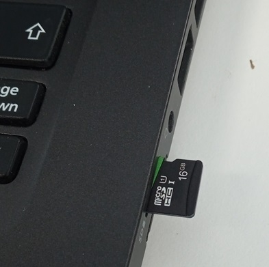
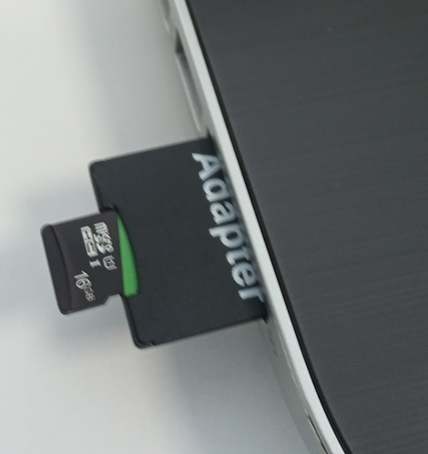
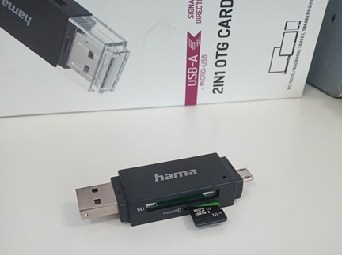
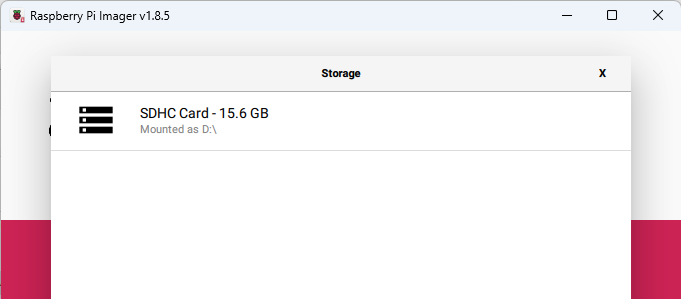
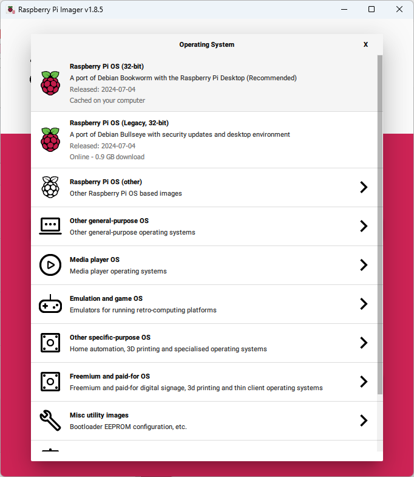
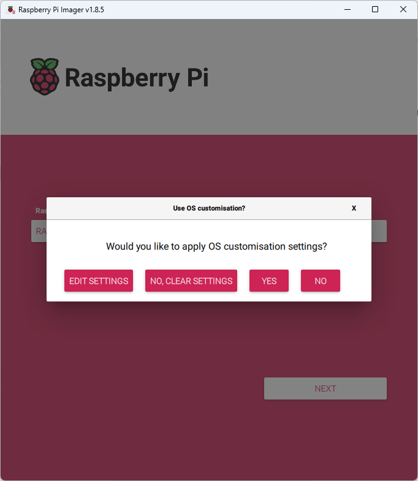

[session1](../../session1/) | [Installing a Raspberry Pi](../InstallingRaspberryPI.md)

# Installing a Raspberry Pi

Raspberry PI is a small single board computer originally designed for education but now also widely used in industrial applications. 

We have provided some pi's to use in class. 
These provided Raspberry Pi2b boards are sufficient for the work we will be doing.
There is no requirement to purchase your own.

However if you want you can  purchase your own boards relatively cheaply.
See [Amazon buy Raspberry PI](https://www.amazon.co.uk/Raspberry-Pi-Model-4GB/dp/B09TTNF8BT).
Note you will want a power supply, mouse, keyboard and micro usb.
The development kits are also quite useful for experimenting.

This note will show how to get started but if you want to know more see the [Raspberry Pi Getting Started Guide](https://www.raspberrypi.com/documentation/computers/getting-started.html)

## Installing the operating system

You will need a 16G Micro SD card.

1\. Download the [Raspberry Pi imager](https://www.raspberrypi.com/software/) version for your laptop.

2\. Install the installer and run it once installed.

3 . Insert the blank miniSD card into a built in SD card reader or a micro SD card USB adaptor
    
    
    


4\. On the Pi Imager, select the SD card
    
    
    
5\. Select the Raspberry Pi 2 Model b device ( or a different device if using your own)
    
    
    
6\. Select the latest 'Bookworm' pi operating system (32 bit) (Note on later pi's you can use 64 bit)
    
    
    
7\. Select 'Edit Sessings' to configure basic settings for the device
    

   a\. Set device name to `respberrypi`+ the number of the device - each device will be given a number on a sticky label e.g. `raspberrypi01'
   
   b\. Set `username` to admin
   
   c\. Set `password` to `minad1234` (we are using the same passwords for all devices)
   
   


8\. Set services to use password authentication
    
   


9\. Finally select write to device to create the OS image.
    
   

## Running your PI

1. Make sure the power is off on your pi and insert the SD card

1. Attach the keyboard and mouse USB cables

1. Insert the WIFI usb dongle

1. Attach the hdmi cable between the monitor hdmi port and the pi hdmi port.

1. Attach the mini-usb power cable and turn on the pi.

You should see the device booting on your monitor.
This may take some time.

Note that you will probably need to change the monitor input to hdmi1  (attach the new cable below the monitor but don't detach the normal PC).

   
   
## setting up wifi with eduroam

Eduroam is a European academic wifi network which students can connect to using their university student accounts.
Older Raspberry PI's used a different configuration method but the following will work with the latest operating system

These instructions are based on using the aduroam installer from https://cat.eduroam.org/
Go to the installer site and download the Solent University installer script for Linux (`eduroam-linux-SUS.py`)

   
   
You need to get this file onto your PI. 
The easiest way is to copy it to a USB memory stick and insert the stick to the PI USB socket.
The USB contents will show up on the desktop.

You can then open a terminal and run the installer in the terminal using python.

```
python eduroam-linux-SUS.py 
```

The installer will set up a new Eduroam Wifi session using a personal identification certificate generated from your username and password. 
Note that you will need to use the same pi (or sd card) each session and delete the eduroam credentials at the end of the module.
The Pi's are individually numbered for this reason.

   

Try opening a browser on the pi and see if you can browse the Internet.
   

   
## Shutting down your pi

It is generally best not to just unplug the pi. 
You should shut it down properly.
You can do this in two ways

Using the desktop 

   

Using the command line (this can be a local terminal or a separate SSH session).
The terminal session is opened by clicking the terminal button.

   

```
shutdown now
```


