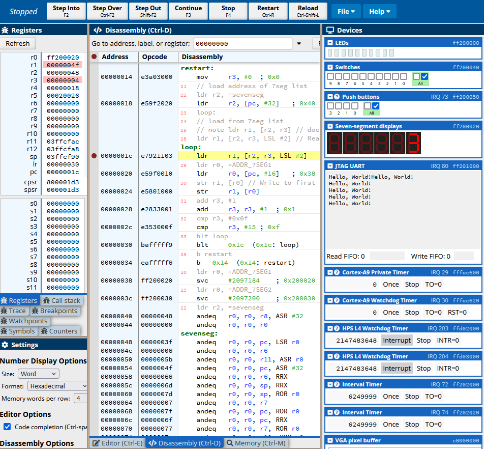

[Main Menu](../../sessions/README.md) | [session6](../../session6/) | [Seven Segment Display Examples](../sevensegment/sevenSegmentDisplayExamples.md)

# Seven Segment Display Examples

In this exercise we will continue our exploration of manipulating hardware devices by looking at the 7 segment displays on the CPUlator.

Seven Segment displays are a technology which can display numerics and symbols using just seven LEDs.
You can see more about symbol mapping in the [Wikipedia 7 segment displays article](https://en.wikipedia.org/wiki/Seven-segment_display)

In the CPUlator, there are 8 separate seven segment displays controlled by two 32 bit registers.

   
   
The displays are controlled by 2 registers located at the following addresses:

```
0xFF200020
0xFF200030
```

Below are links for documentation on the displays 

[7 segment display documentation - Uni Toronto](https://www-ug.eecg.utoronto.ca/desl/nios_devices_SoC/ARM/dev_7segs.html)

[7 segment display manufacturers documentation CPUlator](https://fpgacademy.org/Downloads/DE1-SoC_Computer_ARM.pdf#subsubsection.2.9.2)

## Exercise 1  - Assembler

In this first assembler program, we write to the two registers so that the lowest digit displays `1` and the upper digits are all turned off.

### step 1
Try compiling the assembler program [simple7seg1.s](../sevensegment/code/simple7seg1.s) by pasting the program into the Editor panel, selecting `ARM7`, and pressing `compile`.

You will see the disassembled code.

Now press `continue` and the led displays should display `1`

Have a look at the assembly program and try and work out how it works.

The [ARM cheat sheet will help](https://azeria-labs.com/assembly-basics-cheatsheet/)  but look online for other resources.

### step 2

You now need to work out which bits in the register control which of the display segments.

You will need to create a table which maps all of the hex symbols `0,1,2,3,4,5,6,7,8,9,a,b,c,d,e,f` onto their equivalent 8 bit bytes which will drive the 7 segment display


```
Hex One 1  0x01

0b0000110 (0x06)

    |
    |
    
Hex Eight 0x08

0b1111111 (0x7F)
   _
  |_|
  |_|

```

| hex number | display bits |
|:-----------|:-------------|
|     0x01   |   0x06       |
|     0x02   |   ?          |
|     etc    |              |
|     0x08   |   0x7F       |


Check your answers against the data in the [seven segment mapping](../sevensegment/sevensegmentmapping.md)


### step 3

Now modify the [simple7seg1.s](../sevensegment/code/simple7seg1.s) program to display `12345678`

DONT LOOK at this Answer until you have tried this yourself: [simple7seg2.s](../sevensegment/code/simple7seg2.s)

### step 4

Could you now modify the assembly program to step through the 16 hex numbers and create a display for each.

Answer: [sevenseg.s](../sevensegment/code/sevenseg.s)

If you run this program, you will see the lowest 7 segment digit rapidly changing.

You can slow this down by adding a breakpoint in the editor at the start of the `loop:`.

Then the program will run until the breakpoint and wait until `continue` is pressed.

Note:  you should load this program and set a breakpoint (see red dot) at the `loop:` label (`0x0000001c`).

   
   
## Exercise 2 C Language

The following exercises modify the seven segment display using code written in `C`

   

Each of the following examples can be pasted into the editor and compiled with the Language button set to `C`.

### step 1

Copy and compile the following C code.

```
#define ADDR_7SEG1 ((volatile long *) 0xFF200020)
#define ADDR_7SEG2 ((volatile long *) 0xFF200030)

int main()
{
   # bits 0000110 will activate segments 1 and 2 
   *ADDR_7SEG1 = 0x00000006; 
   *ADDR_7SEG2 = 0;
}
```

The `#define` lines create constants, `ADDR_7SEG1` and `ADDR_7SEG1` which contain the `addresses` of the two seven segment counters.

`   *ADDR_7SEG1 = 0x00000006; ` means put `0x00000006` in the location POINTED TO by ADDRESS `0xFF200020`.

The `*` preceding the variable turns it into a `pointer`

Running this program will put `1` in the first digit of the display.

Try changing this to other values.

### step 2

Try program [sevenSegment1.c](../sevensegment/code/sevenSegment1.c)

This puts sequential hex values `0` to `f` in character 1.

Look for the `main:` label in the Disassembly window.

Put a breakpoint at the line `bl 0x82dc (0x82dc: hexByteToLed)`

Now you can repeatedly press `Continue` to cycle through the breakpoint and count `0 to f`.

Have a look at the code following the `main:` label.

Note that the mapping between each hex number and the seven segments is mapped in the array `unsigned int sevensegment[]`

Try and work out how the program works in assembled code.

### step 3

Now try and write a program which will sequentially put `blank` and `0 - f` in each digit starting with the right most digit and and ending with the left most digit.

   

See answer here [sevenSegment2.c](../sevensegment/code/sevenSegment2.c)

### step 3

Think, how would you extend the program so that you submit any integer number into a procedure and decode it into into an 8 digit seven segment hex number.

   
   
Try to do this before you try the following example code.

This examples works but the numbers are in the wrong order.
[sevenSegment3.c](../sevensegment/code/sevenSegment3.c)

Try and work out what is wrong and correct it.

The fully working answer is here 
[sevenSegment4.c](../sevensegment/code/sevenSegment4.c)

### step 4 - additional exercise

The example above only works for the lower 4 digits. 
How would you extend this to the full 8 digits

### step 5 - for the keen

Can you change the program so that it prints out numbers in DECIMAL instead of HEX?


